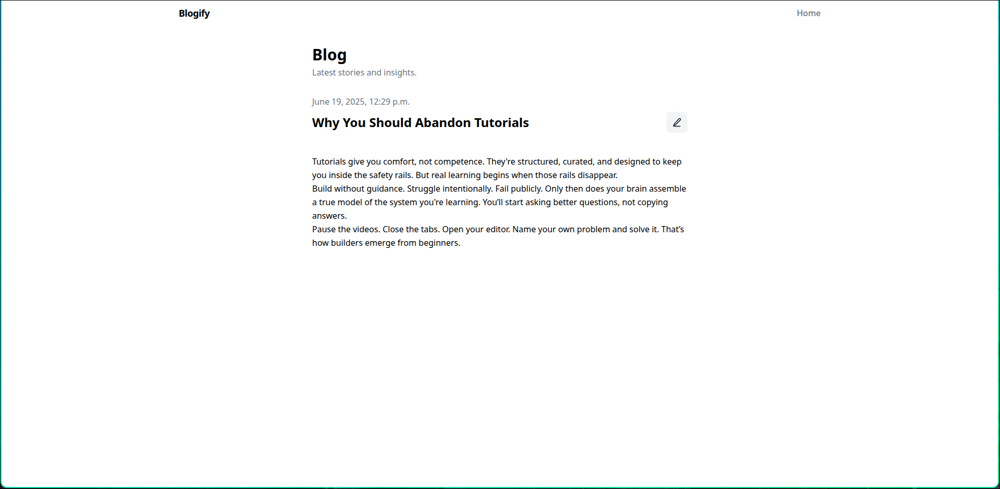

# Blogify

**Blogify** is a minimal blog platform built using **Django**, **Tailwind CSS**, **JavaScript**, and **custom CSS**.
It supports CRUD operations for admin users and read/search access for public users.

---

## ✨ Features

### Public Users
- View all blog posts
- Search posts by title or content
- Open individual posts to read

### Admin Users
- "New" post button on the homepage
- Create, edit, and delete posts
- Admin-only controls via conditional rendering

---

## 📸 Screenshots

### Admin Views

#### Homepage with New Button and Delete Icon


#### Post Detail with Edit Icon


#### Create New Post Form


### Common

#### 404 Page


### User Views

#### Homepage with View-Only Access


#### No Posts State


---

## 🛠️ Tech Stack

- **Backend**: Django
- **Frontend**: Tailwind CSS (via CDN), JavaScript, custom CSS
- **Templating**: Django Templates
- **Icons**: FontAwesome

---

## 🚀 Getting Started

### 1. Clone the Repository

```bash
git clone https://github.com/your-username/blogify.git
cd blogify
```

### 2. Create Virtual Environment

```bash
python -m venv venv
source venv/bin/activate  # On Windows: venv\Scripts\activate
pip install -r requirements.txt
```

### 3. Run Migrations

```bash
python manage.py migrate
```

### 4. Create Superuser

```bash
python manage.py createsuperuser
```

### 5. Start the Server

```bash
python manage.py runserver
```

---

## 🔗 Access URLs

- Homepage: [http://127.0.0.1:8000/](http://127.0.0.1:8000/)
- Admin Panel: [http://127.0.0.1:8000/admin/](http://127.0.0.1:8000/admin/)

---

## 📁 Permissions

| Action          | Public  | Admin   |
|-----------------|---------|---------|
| View Posts      | ✅       | ✅       |
| Search Posts    | ✅       | ✅       |
| View Details    | ✅       | ✅       |
| Create Posts    | ❌       | ✅       |
| Edit Posts      | ❌       | ✅       |
| Delete Posts    | ❌       | ✅       |
| Admin Features  | ❌       | ✅       |

---

## 🧠 Conditional UI Logic

- "New" button only shows on homepage for authenticated users:
```django

    <!-- Render New Button -->

```

---

## 📌 Notes

- Tailwind is loaded via CDN. Consider using the CLI build for production.
- Static files are modularized for clarity.

---

## 📝 License

MIT — use, modify, and distribute with credit.
